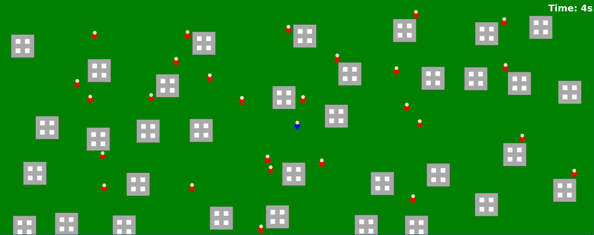

# JavaFX Top View Survival Game

## Overview

This is a top-down (GTA-like) survival game developed using JavaFX. The player controls a character and must avoid colliding with NPCs  that chase the player around a map filled with obstacles (buildings). The goal is to survive as long as possible.

## Gameplay Features

- **Player Control:**
   - Move the character using the arrow keys (Up, Down, Left, Right).
   - The character has a walking animation when moving.

- **NPC Behavior:**
   - NPCs spawn around the map and chase the player.
   - They predict the player's future position to intercept the player.
   - NPCs navigate around obstacles if blocked.

- **Obstacles:**
   - Buildings are randomly placed on the map.
   - Both the player and NPCs must navigate around buildings.

- **Game Mechanics:**
   - The game starts with a 3-second peace time during which NPCs do not move.
   - NPCs are added to the game every 5 seconds, increasing the difficulty.
   - If an NPC collides with the player, it's GAME OVER.

- **User Interface:**
   - A timer displays how long the player has survived.
   - The game runs in full-screen mode for an immersive experience.
   - After GAME OVER, the player can restart the game by pressing SPACE or ENTER.

## How to Run

1. **Prerequisites:**
   - Java Development Kit (JDK) 8 or higher.
   - JavaFX library if using JDK versions earlier than 11.

2. **Setup:**
   - Ensure all the necessary image resources are in the `/resources` folder:
      - `player_idle.png`
      - `player_walk1.png`
      - `player_walk2.png`
      - `npc_walk1.png`
      - `npc_walk2.png`
      - `building.png`

3. **Compile the Game:**
   - Compile all Java classes in the `topviewgame` package.

4. **Run the Game:**
   - Execute the `Main` class to start the game.

## Controls

- **Movement:**
   - **Up Arrow:** Move Up
   - **Down Arrow:** Move Down
   - **Left Arrow:** Move Left
   - **Right Arrow:** Move Right

- **Restart Game:**
   - **SPACE or ENTER:** Restart the game after GAME OVER.

## Game Flow

1. **Start:**
   - The player character spawns near the center of the map.
   - The game begins with a 3-second peace time.

2. **Survive:**
   - Avoid NPCs that chase you around the map.
   - Navigate around buildings to escape.

3. **GAME OVER:**
   - Colliding with an NPC ends the game.
   - A GAME OVER message is displayed with instructions to restart.

4. **Restart:**
   - Press SPACE or ENTER to restart the game.
   - The game resets with new NPCs and buildings.

## Code Structure

- **GamePanel.java:**
   - Main game logic and rendering.
   - Handles player movement, NPC updates, collisions, and game state.

- **NPC.java:**
   - Defines NPC behavior and movement.
   - Implements basic AI for chasing the player and avoiding obstacles.

- **Building.java:**
   - Represents obstacles on the map.
   - Holds the image and position of each building.

- **Main.java:**
   - Entry point of the application.
   - Sets up the primary stage and scene.

## License

This game is provided as-is for educational purposes. Feel free to modify and enhance it according to your needs.
